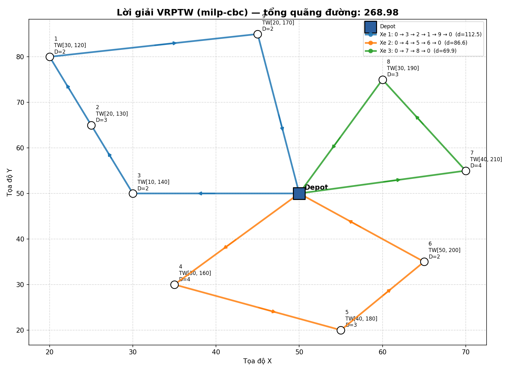

# VRPTW Solver — Bài toán định tuyến xe có ràng buộc khung thời gian

Giải tự động bài toán **Vehicle Routing Problem with Time Windows (VRPTW)**: nhập dữ liệu → giải → in kết quả chi tiết → vẽ plot, chỉ với một lệnh.

*Automatic solver for the Vehicle Routing Problem with Time Windows: load data → solve → print detailed results → plot, in a single command.*



## Tính năng / Features

- **🖥️ Web app song ngữ Việt–Anh / bilingual VI–EN web app** (Streamlit): người dùng tự nhập/sửa dữ liệu trên bảng, upload CSV hoặc sinh ngẫu nhiên, bấm một nút để nhận lời giải tốt nhất + biểu đồ + file tải về / users enter or edit data in a table, upload CSV or generate random instances, then get the best solution, charts and downloadable results in one click
- **Hai solver / two solvers**
  - `ortools` — Google OR-Tools Routing (heuristic, giải nhanh hàng trăm khách hàng / fast, scales to hundreds of customers)
  - `milp` — MILP exact bằng PuLP + CBC, cài đặt **đúng theo mô hình toán (1)–(11)** với tuyến tính hóa Big-M và loại cung không khả thi (arc pruning) / exact MILP implementing the textbook formulation
- **Ba nguồn dữ liệu / three input modes**: instance mẫu, file CSV, hoặc sinh ngẫu nhiên có seed
- **Kiểm tra lời giải tự động / automatic verification**: mỗi khách đúng 1 lần, tải trọng, khung thời gian, trình tự thời gian
- **Plotting**: bản đồ tuyến đường (mũi tên hướng đi, TW & demand từng khách) + biểu đồ Gantt lịch phục vụ so với khung thời gian
- **💰 Mô hình chi phí vận hành / operating cost model**: nhiên liệu & bảo trì theo quãng đường, **lương tài xế theo dặm ($/mile) hoặc theo giờ ($/h)** (trả theo dặm tránh tài xế đi chậm câu giờ), phí quản lý & phí khấu trừ (bảo hiểm) theo xe — tính tự động cho từng tuyến / fuel & maintenance per distance, **driver wage per mile or per hour** (per-mile avoids drivers stalling for hours), management & deductible fees per vehicle
- **📊 Xuất Excel kế toán / accounting Excel export**: file `.xlsx` 4 sheet (Summary, Routes & Costs, Schedule, Input Data) sẵn sàng cho kế toán / 4-sheet workbook ready for bookkeeping
- **Xuất kết quả / export**: JSON lời giải đầy đủ + CSV lịch trình

## Cài đặt / Installation

```bash
pip install -r requirements.txt
```

## Web app (khuyến nghị / recommended)

```bash
streamlit run app.py
```

Mở trình duyệt tại địa chỉ hiện ra (mặc định `http://localhost:8501`):

- Chọn ngôn ngữ **Tiếng Việt / English** ở thanh bên
- Nhập/sửa trực tiếp bảng dữ liệu khách hàng (thêm/xóa hàng), upload CSV, hoặc sinh ngẫu nhiên
- Chỉnh số xe (tối đa 50), sức chứa, thuật toán, time limit
- Nhập đơn giá chi phí trong mục **💰 Chi phí vận hành**: nhiên liệu, bảo trì, lương, phí quản lý, phí khấu trừ, ký hiệu tiền tệ
- Bấm **🚀 Giải bài toán / Solve** → nhận tuyến tối ưu, bản đồ tuyến, lịch Gantt, bảng chi phí từng xe, và tải về **Excel kế toán** / JSON / CSV

*Pick your language in the sidebar, edit the customer table directly (add/remove rows), upload a CSV or generate a random instance, then click Solve to get optimal routes, a route map, a Gantt schedule, and JSON/CSV downloads.*

## Dòng lệnh / Command line

```bash
# Instance mẫu (9 khách hàng, 3 xe), solver OR-Tools
python main.py

# Giải exact bằng MILP (CBC) — đúng mô hình (1)-(11)
python main.py --solver milp

# Chạy cả hai và so sánh
python main.py --solver both

# Instance ngẫu nhiên 15 khách hàng, 4 xe
python main.py --instance random --customers 15 --vehicles 4 --capacity 12 --seed 7

# Dữ liệu riêng từ CSV
python main.py --instance examples/sample_instance.csv --vehicles 3 --capacity 10
```

Định dạng CSV / CSV format:

```csv
node,x,y,demand,ready_time,due_time,service_time
0,50,50,0,0,300,0      # node 0 = depot
1,20,80,2,30,120,5
...
```

Kết quả lưu trong `results/`: `*_routes.png`, `*_schedule.png`, `*_solution.json`.

## Mô hình toán / Mathematical model

Depot tách thành node `0` (xuất phát) và `n+1` (kết thúc). Biến `x_ijk = 1` nếu xe `k` đi cung `(i,j)`; `w_ik` là thời điểm xe `k` bắt đầu phục vụ tại `i`.

```text
(VRPTW)  min Σ_k Σ_(i,j)∈A c_ij·x_ijk                                  (1)
s.t.   Σ_k Σ_{j∈A+(i)} x_ijk = 1            ∀i ∈ N    — mỗi khách 1 lần (2)
       Σ_{j∈A+(0)} x_0jk = 1                ∀k        — xuất phát depot (3)
       dòng vào = dòng ra tại mỗi khách      ∀k, ∀j ∈ N                 (4)
       Σ_{i∈A-(n+1)} x_{i,n+1,k} = 1        ∀k        — kết thúc depot  (5)
       w_ik + s_i + t_ij − w_jk ≤ M_ij(1 − x_ijk)     — Big-M time      (6)
       a_i·Σx_ijk ≤ w_ik ≤ b_i·Σx_ijk       ∀k, ∀i ∈ N — time window    (7)
       E ≤ w_ik ≤ L                          ∀k, i ∈ {0, n+1}           (8)
       Σ_i d_i·Σ_j x_ijk ≤ C                ∀k        — tải trọng       (9)
       x_ijk ∈ {0,1}                                                (10,11)
```

Cung `(i,j)` bị loại trước khi giải nếu `a_i + s_i + t_ij > b_j` (không thể đến kịp) hoặc `d_i + d_j > C` (vượt tải) — giảm đáng kể kích thước mô hình.

## Cấu trúc project / Project structure

```text
vrptw-solver/
├── main.py                  # CLI: giải + in + vẽ tự động
├── vrptw/
│   ├── instance.py          # dữ liệu bài toán (sample / CSV / random)
│   ├── solution.py          # cấu trúc lời giải + verify + xuất JSON
│   ├── solver_ortools.py    # solver heuristic (OR-Tools)
│   ├── solver_milp.py       # solver exact (PuLP + CBC), mô hình (1)-(11)
│   └── plotting.py          # bản đồ tuyến + Gantt khung thời gian
├── examples/sample_instance.csv
└── requirements.txt
```

## Ghi chú / Notes

- Khoảng cách Euclid được dùng làm cả chi phí `c_ij` và thời gian di chuyển `t_ij` (tốc độ = 1). Với OR-Tools, khoảng cách scale ×100 sang số nguyên để giữ độ chính xác.
- MILP cho lời giải **tối ưu chứng minh được** với instance nhỏ–vừa (~10–25 khách); OR-Tools cho lời giải tốt rất nhanh với instance lớn.
- Lấy cảm hứng từ series "Vận trù học" — Phần 11: VRPTW.
